# Fraud Detection Project

## Overview

The goal of this project was to train a Machine Learning model to identify fraudulent transactions while minimizing errors in classifying legitimate transactions as fraudulent. The dataset used was sourced from Kaggle, and it is available [here](https://www.kaggle.com/datasets/kartik2112/fraud-detection).

## Data Split: Training, Validation, and Test

Considering this is a time-series problem, the data was split as follows:

- **Training**: From 01/01/2019 to 21/06/2020, with 7,506 fraudulent transactions and 1,289,169 legitimate transactions.
- **Validation**: From 22/06/2020 to 30/09/2020, with 1,191 fraudulent transactions and 269,359 legitimate transactions.
- **Test**: From 01/10/2020 to 31/12/2020, with 936 fraudulent transactions and 280,585 legitimate transactions.

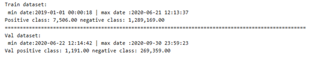
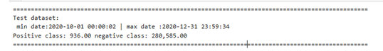

The objective is to identify the highest number of fraudulent transactions and classify legitimate transactions correctly while maintaining class balance.

## Evaluation Metrics

The following metrics were used to evaluate the model:

- **Accuracy**: Percentage of correct predictions. In fraud detection, accuracy can be high by predicting "non-fraud" all the time, which would not be useful.
  
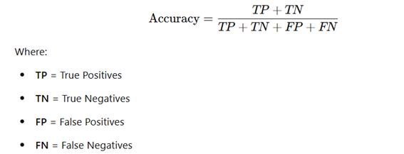

- **Precision**: The proportion of transactions predicted as fraud that are actually fraudulent.

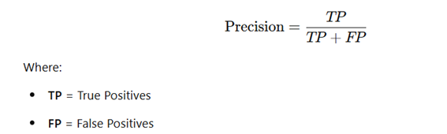

- **Recall**: The proportion of fraudulent transactions correctly identified by the model.

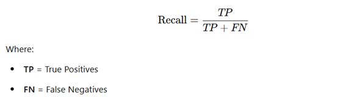

- **F1-Score**: The harmonic mean of precision and recall, providing a balance between both.

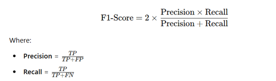

- **AUC (Area Under the ROC Curve)**: Measures the model's ability to distinguish between fraud and non-fraud classes.

The main metric chosen was **F1-Score** as it provides a good balance between detecting fraud and minimizing false classification of legitimate transactions as fraud.

## Models Used

The following models were tested:

- **Random Forest**
- **XGBoost**
- **LightGBM (LGBM)**

## Methodology

### Baseline

The first step was to train the models with the original data, without any additional features, and use minimally processed data to establish the **baseline**. The model with the best F1-Score was **XGBoost**. However, due to long training times when tuning hyperparameters and selecting features, I opted to use **LGBM**, which performed well but is lighter and more efficient for large datasets.
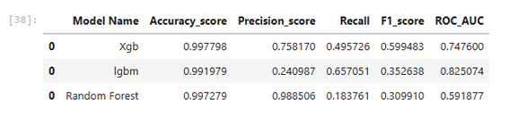

### Version 1

In the first version, I created temporal features, such as the time difference between transactions and the number of daily transactions. I used **SelectKBest** from scikit-learn to select the most relevant features after tuning the hyperparameters with **Optuna**. Although it may seem counterintuitive to tune the hyperparameters before selecting features, research indicates that doing so can create a more efficient model, as the tuned model can discard or include features more accurately. After testing several **k** combinations, the best selection was **32 features**.

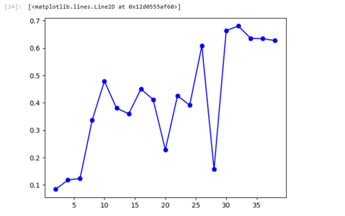

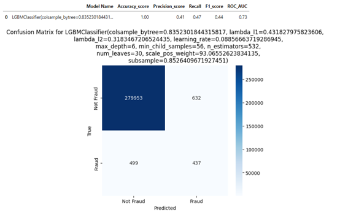

### Version 2

With the first version, I obtained an **F1-Score of 0.44** after feature engineering, hyperparameter tuning, and selecting the best features.

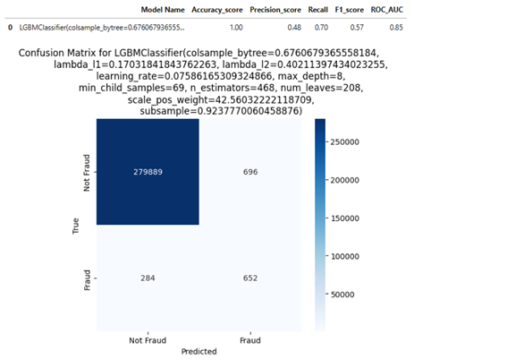

### Version 3

Before proceeding with version 3, I analyzed the behavior of fraudulent and non-fraudulent transactions and noticed that fraudulent transactions tend to have a longer time interval between them compared to legitimate transactions, possibly to camouflage and avoid detection. Additionally, the average value of fraudulent transactions was higher than that of legitimate transactions.

Based on these insights, I derived new features such as the average time between transactions and the mean and standard deviation of transaction values. After tuning the hyperparameters again with the dataset containing the new features, I obtained an **F1-Score of 0.72** on the training data. The creation of new features played a crucial role in this improvement.

One key idea for feature selection came from Kaggle Grandmaster **Mario Filho**, who suggests that feature engineering should consider aggregations, rolling averages, and lags between dates. You can view his video [here](https://www.youtube.com/watch?v=ft77eXtn30Q&ab_channel=MarioFilhoEnglish).

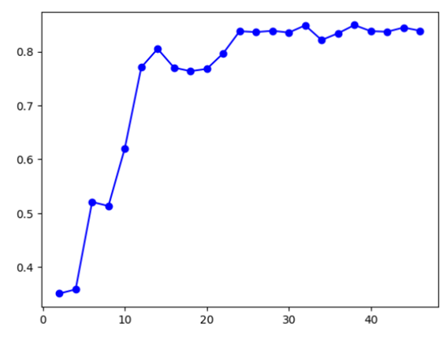

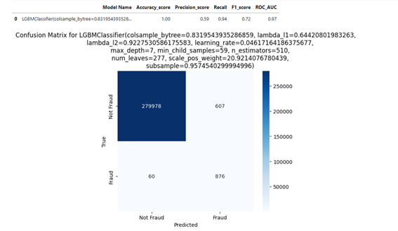

The model's performance significantly improved with the introduction of new features, such as **rolling_min_3** (last 3 transactions) and **time_diff_seconds** (time difference in seconds between consecutive transactions).

## Conclusion and Next Steps

This project highlighted the importance of creating new features to improve the model's performance. The **F1-Score** improvement demonstrated the positive impact of **feature engineering**. However, there is still room for improvement, especially in feature selection. In future cycles, I plan to explore tools like **Featurewiz** and **Boruta** for more effective feature selection, comparing their results, and testing which approach performs better.

